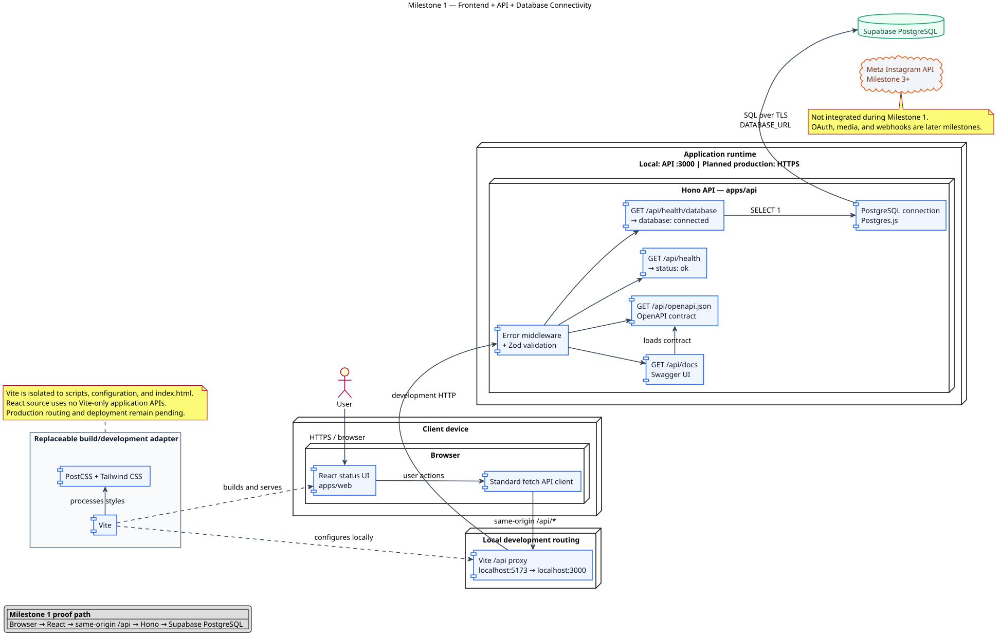
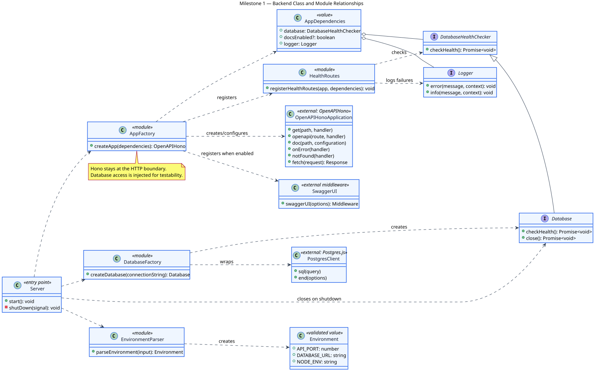
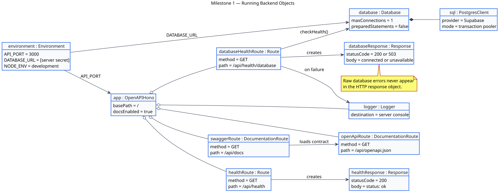
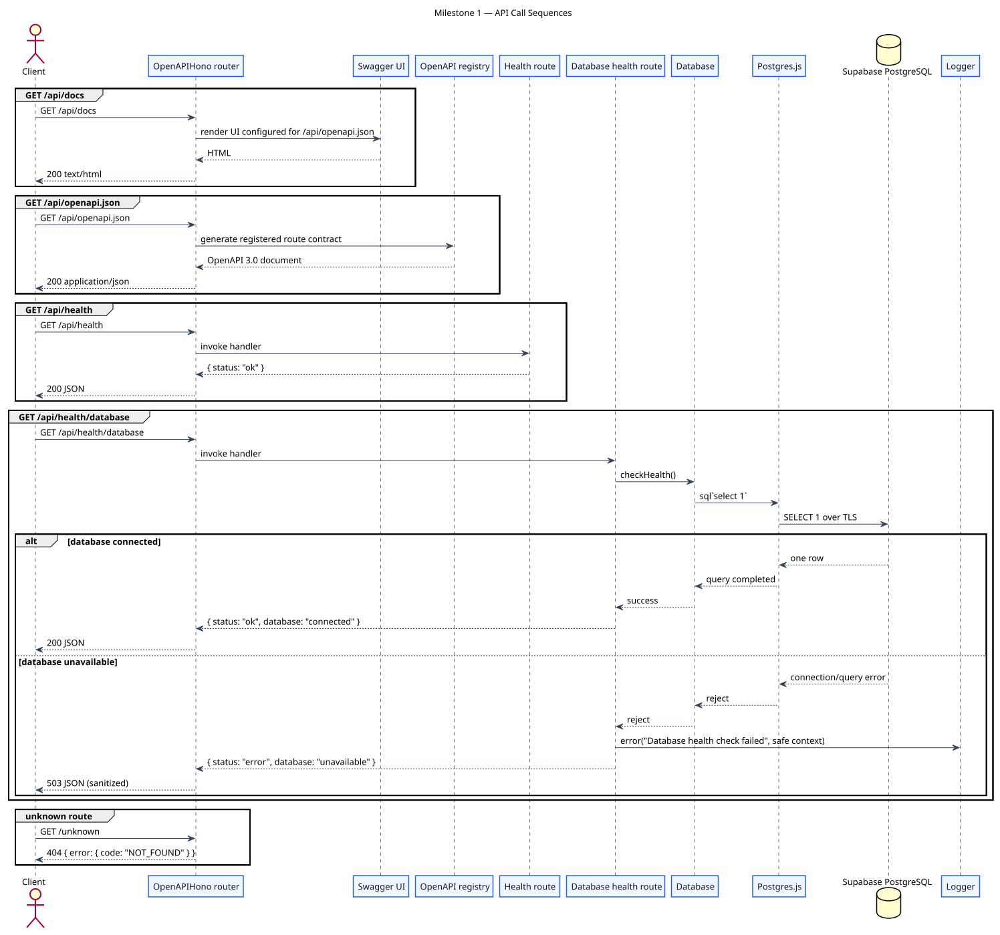
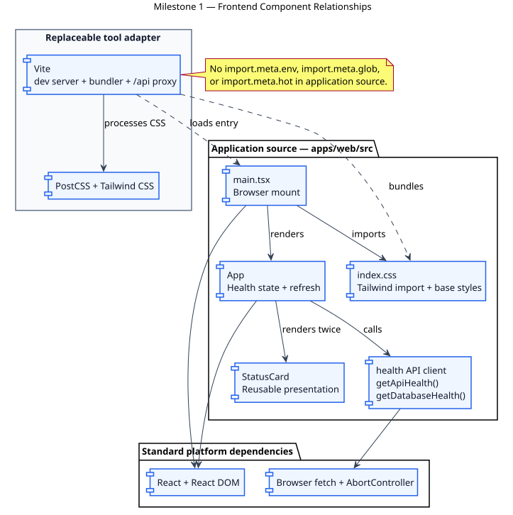
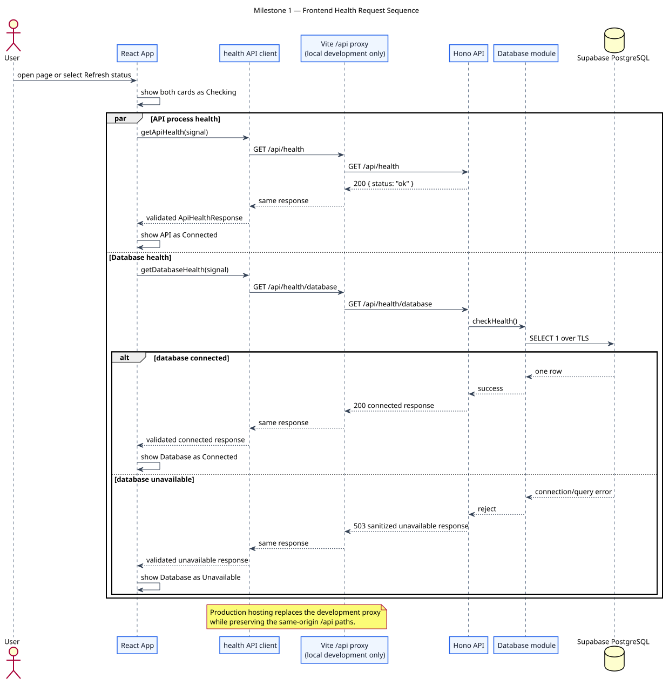

# First Vertical Slice — Implementation Plan

## Instagram Login → Select Post → `#Hello` → Public Reply → Activity

**Date:** 2026-09-01 **Status:** Ready to execute **Task system:** Simple checklist, no Beads

## Target outcome

The first vertical slice is complete when this works:

```text
Instagram Professional login
        ↓
show @username
        ↓
show latest 12 posts/reels
        ↓
select one post
        ↓
set public reply text
        ↓
enable automation
        ↓
someone comments exactly #Hello
        ↓
webhook received
        ↓
exact rule matched
        ↓
public reply sent
        ↓
activity shows SUCCESS
```

---

# Milestone 0 — Project foundation

## Goal

Create a clean monorepo that runs locally.

## Todo

- [x] Create GitHub repository
- [x] Initialize pnpm workspace
- [x] Add root `package.json`
- [x] Add `pnpm-workspace.yaml`
- [x] Create:

```text
apps/web
apps/api
packages/domain
packages/application
packages/ports
packages/infrastructure
packages/contracts
db/migrations
tests/unit
tests/integration
tests/fixtures
doc
```

- [x] Add TypeScript configuration
- [x] Add `.gitignore`
- [x] Add `.env.example`
- [x] Confirm real `.env` files are ignored
- [x] Add root scripts: `dev`, `build`, `test`, `typecheck`
- [x] Run `pnpm install`
- [x] Push first commit to GitHub

## Done when

```text
✓ pnpm install works
✓ repository pushes to GitHub
✓ workspace packages are recognized
✓ no secrets are committed
```

---

# Milestone 1 — Frontend + API + database connectivity

## Goal

Prove the basic infrastructure before Instagram:

```text
Browser → React → API → PostgreSQL
```

## Architecture



Editable source: [`diagrams/milestone-1-architecture.puml`](diagrams/milestone-1-architecture.puml)

### Backend class relationships



Editable source:
[`diagrams/milestone-1-class-diagram.puml`](diagrams/milestone-1-class-diagram.puml)

### Running backend objects



Editable source:
[`diagrams/milestone-1-object-diagram.puml`](diagrams/milestone-1-object-diagram.puml)

### API call sequences



Editable source:
[`diagrams/milestone-1-call-sequence.puml`](diagrams/milestone-1-call-sequence.puml)

### Frontend component relationships



Editable source:
[`diagrams/milestone-1-frontend-components.puml`](diagrams/milestone-1-frontend-components.puml)

### Frontend request sequence



Editable source:
[`diagrams/milestone-1-frontend-call-sequence.puml`](diagrams/milestone-1-frontend-call-sequence.puml)

## Frontend

- [x] Create React + Vite app in `apps/web`
- [x] Add TypeScript
- [x] Add Tailwind through PostCSS
- [x] Create minimal mobile-first status page
- [x] Add validated backend health API client
- [x] Add portable same-origin `/api` routing with a development proxy

## Backend

- [x] Create Node.js API in `apps/api`
- [x] Add Hono
- [x] Add Zod
- [x] Add error middleware
- [x] Add `GET /api/health`

Expected:

```json
{ "status": "ok" }
```

## Database

- [x] Create Supabase project
- [x] Configure `DATABASE_URL`
- [x] Configure `DATABASE_MIGRATION_URL`
- [x] Add Postgres.js
- [x] Add PostgreSQL connection module
- [x] Add `GET /api/health/database`
- [x] Endpoint runs `select 1`

Expected:

```json
{ "status": "ok", "database": "connected" }
```

## Developer documentation

- [x] Add TSDoc comments to exported backend declarations
- [x] Add strict TypeDoc generation
- [x] Document exported frontend declarations
- [x] Generate an OpenAPI specification from Hono and Zod route definitions
- [x] Add local Swagger UI with manual request execution
- [x] Add architecture, class, object, and call-sequence diagrams

Local documentation endpoints:

```text
http://localhost:3000/api/docs
http://localhost:3000/api/openapi.json
```

Generated TypeDoc sites:

```text
dist/docs/api-code/index.html
dist/docs/web-code/index.html
```

## Deployment

- [ ] Create Vercel project
- [ ] Connect GitHub repository
- [ ] Configure production env variables
- [ ] Deploy
- [ ] Test `/api/health`
- [ ] Test `/api/health/database`

## Done when

```text
✓ frontend works locally
✓ API works locally
✓ database works locally
□ frontend, API, and database proof deployed and verified in production
```

---

# Milestone 2 — Database schema + security

## Goal

Create the persistence and security needed by the vertical slice.

## Migrations

- [ ] `instagram_accounts`
  - `id`
  - `instagram_user_id UNIQUE`
  - `username`
  - `access_token_ciphertext`
  - `token_expires_at`
  - timestamps
- [ ] `sessions`
  - `id`
  - `account_id`
  - `token_hash UNIQUE`
  - `expires_at`
  - `created_at`
- [ ] `automations`
  - `id`
  - `account_id UNIQUE`
  - `media_id`
  - `trigger_text`
  - `reply_text`
  - `enabled`
  - timestamps
- [ ] `executions`
  - `id`
  - `automation_id`
  - `instagram_comment_id UNIQUE`
  - `commenter_username`
  - `comment_text`
  - `status`
  - `error_code`
  - `error_message`
  - timestamps

## Ports/repositories

- [ ] `AccountRepository`
- [ ] `SessionRepository`
- [ ] `AutomationRepository`
- [ ] `ExecutionRepository`
- [ ] PostgreSQL implementations for each

## Security

- [x] Add `TokenProtector` interface
- [x] Implement AES-256-GCM using Node `crypto`
- [x] Add `TOKEN_ENCRYPTION_KEY`
- [x] Create secure random session token
- [ ] Store only session token hash in DB
- [ ] Use HTTP-only cookie
- [ ] Add session middleware
- [ ] Add logout

## Done when

```text
✓ migrations apply cleanly
✓ repositories read/write data
✓ access-token encryption works
✓ session create/read/logout works
✓ raw Instagram tokens are not stored unencrypted
```

---

# Milestone 3 — Real Instagram login

## Goal

First real external checkpoint:

```text
Continue with Instagram → OAuth → @username
```

## Meta setup

- [ ] Configure Meta App for Instagram Login
- [ ] Use permissions:
  - `instagram_business_basic`
  - `instagram_business_manage_comments`
- [ ] Configure `META_APP_ID`
- [ ] Configure `META_APP_SECRET`
- [ ] Configure `META_API_VERSION`
- [ ] Configure `META_REDIRECT_URI`
- [ ] Verify test account is Business or Creator

## Backend OAuth

- [ ] `GET /api/auth/instagram/start`
- [ ] Generate/validate OAuth state
- [ ] Redirect to Instagram authorization
- [ ] `GET /api/auth/instagram/callback`
- [ ] Exchange authorization code server-side
- [ ] Fetch Instagram Professional account ID
- [ ] Fetch username
- [ ] Encrypt/store access token
- [ ] Save account
- [ ] Create app session
- [ ] Set HTTP-only cookie
- [ ] Redirect to `/app`

## API

- [ ] `GET /api/me`
- [ ] `POST /api/auth/logout`

## Frontend

- [ ] Connect screen
- [ ] `Continue with Instagram`
- [ ] Show `Connected as @username`
- [ ] Logout button
- [ ] Loading/error states

## Tests

- [ ] OAuth state validation
- [ ] unauthenticated `/api/me`
- [ ] authenticated `/api/me`
- [ ] session expiration
- [ ] token encryption

## Done when

```text
✓ real Instagram login works
✓ correct @username appears
✓ session survives refresh
✓ logout works
✓ access token never reaches browser
```

---

# Milestone 4 — Load real media + save automation

## Goal

Let the owner select one real media item and save one automation.

## Instagram integration

- [ ] Add `InstagramClient.listRecentMedia(...)`
- [ ] Implement real Meta adapter
- [ ] Limit to 12 media items
- [ ] Normalize Meta response into internal media model

## API

- [ ] `GET /api/media?limit=12`
- [ ] Require authentication
- [ ] Decrypt server-side Instagram token
- [ ] Return app-owned Media DTOs
- [ ] `GET /api/automation`
- [ ] `PUT /api/automation`

Save input:

```json
{
  "mediaId": "178...",
  "replyText": "Hello! Thanks for commenting.",
  "enabled": true
}
```

Backend always stores:

```text
trigger_text = "#Hello"
```

## Frontend

- [ ] Display latest 12 media items
- [ ] Responsive mobile-first grid
- [ ] Show thumbnail/media type/caption preview
- [ ] Allow exactly one selection
- [ ] Show read-only trigger `#Hello`
- [ ] Editable reply textarea
- [ ] Enabled toggle
- [ ] Save button
- [ ] Save success/error state
- [ ] Reload persisted automation after refresh

## Validation

- [ ] `mediaId` required
- [ ] `replyText` required
- [ ] trim reply text
- [ ] reject empty reply
- [ ] trigger cannot be changed via API

## Done when

```text
✓ latest 12 real media appear
✓ one media can be selected
✓ reply can be edited
✓ automation persists
✓ refresh restores configuration
```

This is the first strong visible product checkpoint.

---

# Milestone 5 — Webhook verification + comment subscription

## Goal

Make Meta send real comment events to the app.

## Environment

- [ ] Add `META_WEBHOOK_VERIFY_TOKEN`

## API

- [ ] `GET /api/webhooks/instagram` for verification
- [ ] `POST /api/webhooks/instagram` for deliveries
- [ ] Validate webhook payload
- [ ] Log sanitized event
- [ ] Return successful acknowledgement

## Instagram integration

- [ ] Add `InstagramClient.subscribeToComments(...)`
- [ ] Implement subscription to `comments`
- [ ] Make repeated subscription safe

## Normalize webhook

Convert raw Meta payload into:

```ts
type CommentEvent = {
  instagramAccountId: string;
  commentId: string;
  mediaId: string;
  username: string | null;
  text: string;
  receivedAt: Date;
};
```

- [ ] Validate required fields
- [ ] Add webhook test fixtures
- [ ] Keep raw Meta structure out of application/domain layers

## Production

- [ ] Deploy webhook route
- [ ] Configure Meta callback URL
- [ ] Configure verification token
- [ ] Complete Meta verification
- [ ] Subscribe connected account to comments

## Manual test

- [ ] Comment on selected media from another Instagram account
- [ ] Confirm real webhook reaches backend

No automated reply required yet.

## Done when

```text
✓ webhook verification succeeds
✓ comments subscription succeeds
✓ real comment reaches backend
✓ event normalizes to CommentEvent
```

---

# Milestone 6 — Exact matching + idempotency + real public reply

## Goal

Turn the webhook into the automation.

## Domain rule

Implement:

```ts
commentText.trim() === '#Hello';
```

Tests:

- [ ] `#Hello` → match
- [ ] `#Hello` → match
- [ ] `#hello` → no
- [ ] `Hello` → no
- [ ] `#Hello!` → no
- [ ] `#Hello please` → no

## `ProcessComment` use case

- [ ] Find account by Instagram ID
- [ ] Find enabled automation for media ID
- [ ] Stop if no automation
- [ ] Exact-match text
- [ ] Stop if not matched
- [ ] Atomically claim execution
- [ ] Stop if duplicate
- [ ] Send public Instagram reply
- [ ] Mark execution succeeded
- [ ] Mark execution failed safely on error

## Idempotency

Use database constraint:

```text
executions.instagram_comment_id UNIQUE
```

Atomic insert concept:

```sql
insert into executions (...)
values (...)
on conflict (instagram_comment_id) do nothing
returning id;
```

- [ ] Database uniqueness is authoritative
- [ ] No in-memory-only duplicate protection

## Instagram reply adapter

- [ ] Add `InstagramClient.replyToComment(...)`
- [ ] Implement current Meta public reply call
- [ ] Keep Meta HTTP details inside infrastructure adapter
- [ ] Sanitize Meta errors

## Tests

- [ ] unknown account → no reply
- [ ] no automation → no reply
- [ ] disabled automation → no reply
- [ ] wrong media → no reply
- [ ] wrong comment → no reply
- [ ] correct comment → one reply
- [ ] duplicate event → still one total reply
- [ ] Meta failure → failed execution

## Done when

```text
✓ real #Hello receives configured public reply
✓ #hello does not
✓ #Hello please does not
✓ same comment cannot trigger twice
```

This is the core functional checkpoint.

---

# Milestone 7 — Activity UI + vertical slice completion

## Goal

Show automation results to the owner.

## API

- [ ] `GET /api/executions?limit=50`
- [ ] Require authentication
- [ ] Return only current account's executions
- [ ] Newest first
- [ ] Return safe error information

## Frontend

Add Recent Activity:

```text
SUCCESS
@john
#Hello
Reply sent
10:42
```

- [ ] loading state
- [ ] empty state
- [ ] success state
- [ ] failure state
- [ ] mobile layout
- [ ] desktop layout

## Final acceptance test

### Login

- [ ] Open production app
- [ ] Login with Instagram
- [ ] Correct `@username` appears

### Configuration

- [ ] Latest media appears
- [ ] Select one media item
- [ ] Enter custom reply
- [ ] Enable automation
- [ ] Save

### Negative tests

- [ ] Comment `#hello` → no automated reply
- [ ] Comment `#Hello please` → no automated reply

### Positive test

- [ ] Comment `#Hello`
- [ ] Configured public reply appears

### Activity

- [ ] Execution appears as `succeeded`
- [ ] Correct username/comment/timestamp appears

### Duplicate test

- [ ] Replay same webhook fixture/comment ID
- [ ] No second reply is produced

## Done when

```text
✓ full real vertical flow works
✓ automated tests pass
✓ production deployment works
✓ mobile and desktop UI work
✓ secrets stay server-side
```

---

# Milestone summary

| Milestone | Result                                         |
| --------- | ---------------------------------------------- |
| M0        | Repository and monorepo exist                  |
| M1        | Frontend + API + Supabase work                 |
| M2        | DB schema, sessions and encryption work        |
| M3        | Real Instagram login shows `@username`         |
| M4        | Real media loads and automation saves          |
| M5        | Real comment webhook reaches backend           |
| M6        | `#Hello` produces real public reply            |
| M7        | Activity shows result; vertical slice complete |

---

# Recommended stop-and-test checkpoints

## Checkpoint A — after M1

```text
frontend → backend → database
```

Do not start Meta integration until this works.

## Checkpoint B — after M3

```text
real Instagram login → @username
```

Fix OAuth before continuing if this fails.

## Checkpoint C — after M4

```text
@username → 12 media → save automation
```

## Checkpoint D — after M5

```text
real Instagram comment → webhook received
```

Do not build reply logic until this works.

## Checkpoint E — after M6

```text
#Hello → public reply
```

## Checkpoint F — after M7

```text
#Hello → public reply → Activity SUCCESS
```

Vertical slice is complete.

---

# Do not add during this vertical slice

```text
private DMs
new follower automation
editable keyword
multiple keywords
multiple automations
multiple Instagram accounts
teams/workspaces
billing
Stripe
AI-generated replies
LLM runtime
analytics charts
queue
Redis
CRM
native mobile app
Supabase Auth
ORM
Beads
```

If one of these appears necessary, document why before expanding scope.

---

# Final definition of success

A real user can complete this without developer intervention:

```text
1. Login with Instagram
2. See their Professional account
3. Select one of their latest posts/reels
4. Write a public reply
5. Enable automation
6. Another user comments exactly #Hello
7. The configured public reply appears
8. The owner sees SUCCESS in Activity
```

After that, freeze v0.1 and decide the next vertical slice separately.
