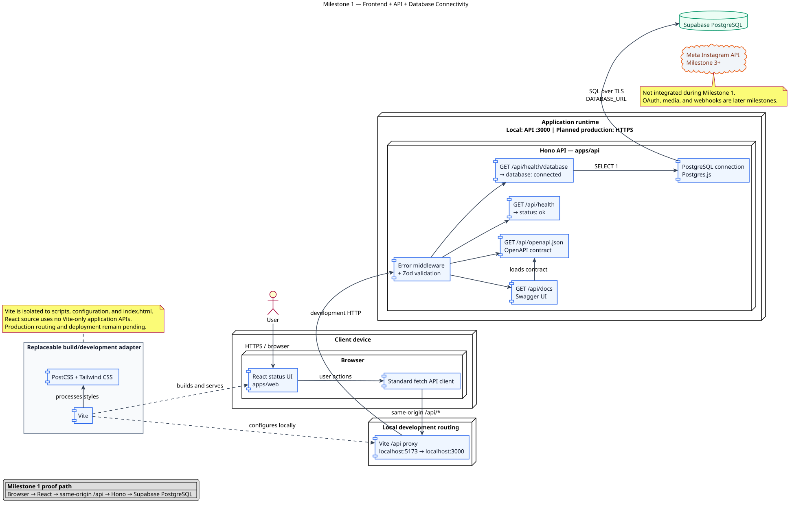
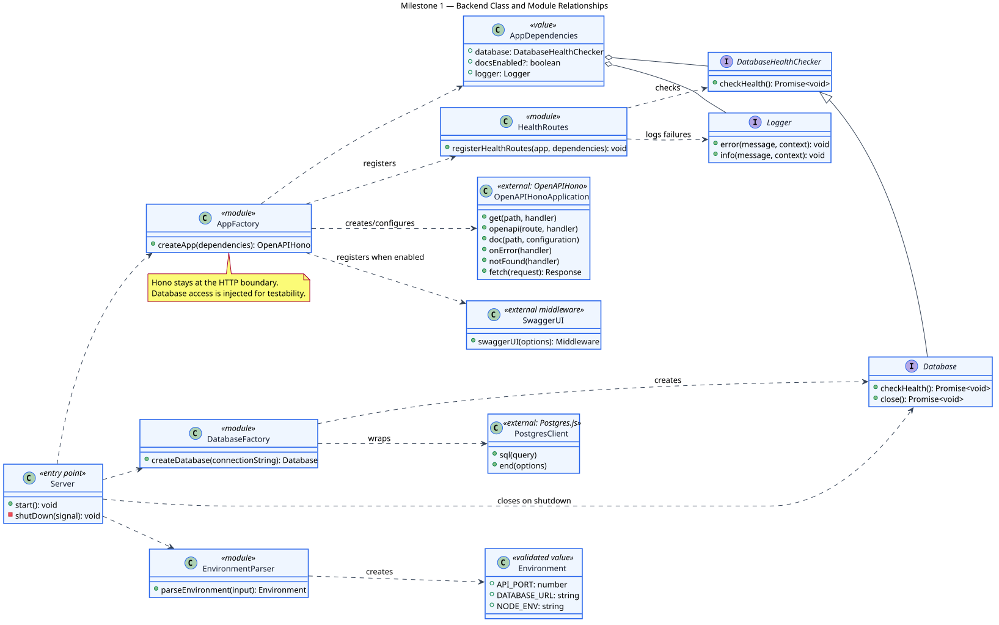
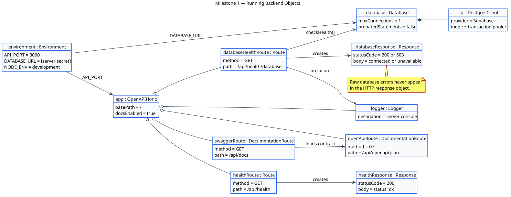
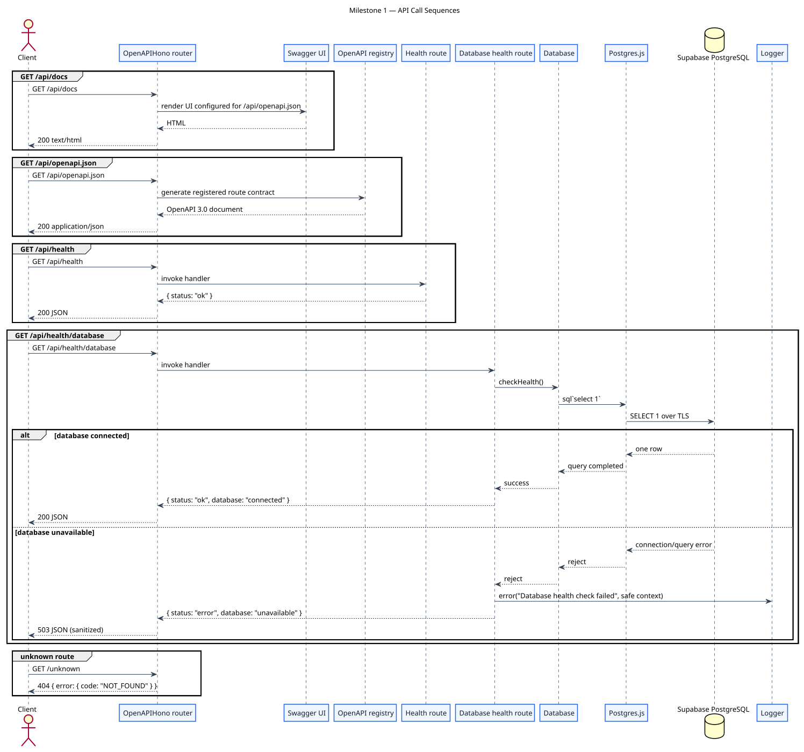
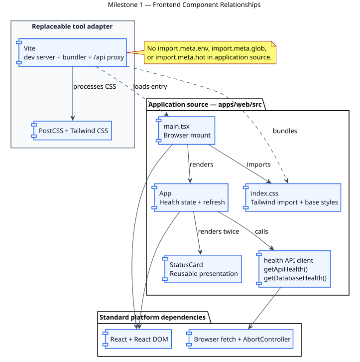
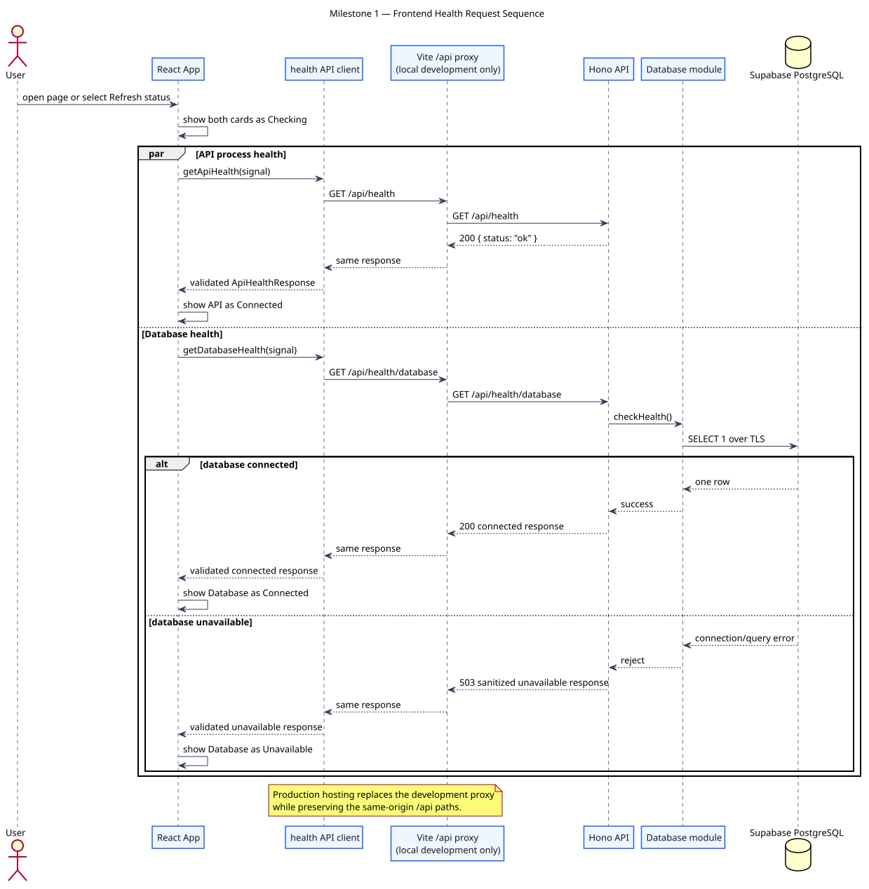

# First Vertical Slice — Implementation Plan

## Instagram Login → Select Post → Hashtag Trigger → Public/Private Reply → Activity

**Date:** 2026-09-01 **Status:** Ready to execute **Task system:** Simple checklist, no Beads

## Target outcome

The first vertical slice is complete when this works:

```text
Instagram Professional login
        ↓
show @username
        ↓
show latest 12 posts/reels
        ↓
select one post
        ↓
choose public reply, private DM, or both
        ↓
enable automation
        ↓
someone comments the configured hashtag
        ↓
webhook received
        ↓
exact rule matched
        ↓
selected delivery channels sent
        ↓
activity shows SUCCESS
```

---

# Milestone 0 — Project foundation

## Goal

Create a clean monorepo that runs locally.

## Todo

- [x] Create GitHub repository
- [x] Initialize pnpm workspace
- [x] Add root `package.json`
- [x] Add `pnpm-workspace.yaml`
- [x] Create:

```text
apps/web
apps/api
packages/domain
packages/application
packages/ports
packages/infrastructure
packages/contracts
db/migrations
tests/unit
tests/integration
tests/fixtures
doc
```

- [x] Add TypeScript configuration
- [x] Add `.gitignore`
- [x] Add `.env.example`
- [x] Confirm real `.env` files are ignored
- [x] Add root scripts: `dev`, `build`, `test`, `typecheck`
- [x] Run `pnpm install`
- [x] Push first commit to GitHub

## Done when

```text
✓ pnpm install works
✓ repository pushes to GitHub
✓ workspace packages are recognized
✓ no secrets are committed
```

---

# Milestone 1 — Frontend + API + database connectivity

## Goal

Prove the basic infrastructure before Instagram:

```text
Browser → React → API → PostgreSQL
```

## Architecture



Editable source: [`diagrams/milestone-1-architecture.puml`](diagrams/milestone-1-architecture.puml)

### Backend class relationships



Editable source:
[`diagrams/milestone-1-class-diagram.puml`](diagrams/milestone-1-class-diagram.puml)

### Running backend objects



Editable source:
[`diagrams/milestone-1-object-diagram.puml`](diagrams/milestone-1-object-diagram.puml)

### API call sequences



Editable source:
[`diagrams/milestone-1-call-sequence.puml`](diagrams/milestone-1-call-sequence.puml)

### Frontend component relationships



Editable source:
[`diagrams/milestone-1-frontend-components.puml`](diagrams/milestone-1-frontend-components.puml)

### Frontend request sequence



Editable source:
[`diagrams/milestone-1-frontend-call-sequence.puml`](diagrams/milestone-1-frontend-call-sequence.puml)

## Frontend

- [x] Create React + Vite app in `apps/web`
- [x] Add TypeScript
- [x] Add Tailwind through PostCSS
- [x] Create minimal mobile-first status page
- [x] Add validated backend health API client
- [x] Add portable same-origin `/api` routing with a development proxy

## Backend

- [x] Create Node.js API in `apps/api`
- [x] Add Hono
- [x] Add Zod
- [x] Add error middleware
- [x] Add `GET /api/health`

Expected:

```json
{ "status": "ok" }
```

## Database

- [x] Create Supabase project
- [x] Configure `DATABASE_URL`
- [x] Configure `DATABASE_MIGRATION_URL`
- [x] Add Postgres.js
- [x] Add PostgreSQL connection module
- [x] Add `GET /api/health/database`
- [x] Endpoint runs `select 1`

Expected:

```json
{ "status": "ok", "database": "connected" }
```

## Developer documentation

- [x] Add TSDoc comments to exported backend declarations
- [x] Add strict TypeDoc generation
- [x] Document exported frontend declarations
- [x] Generate an OpenAPI specification from Hono and Zod route definitions
- [x] Add same-origin Swagger UI with manual request execution
- [x] Add architecture, class, object, and call-sequence diagrams

Local documentation endpoints:

```text
http://localhost:3000/api/docs
http://localhost:3000/api/openapi.json
```

Generated TypeDoc sites:

```text
dist/docs/api-code/index.html
dist/docs/web-code/index.html
```

## Deployment

- [x] Add a Hono serverless entry point
- [x] Add same-origin Vercel routing for the web and API services
- [x] Create Vercel project
- [x] Connect GitHub repository
- [x] Configure production env variables
- [x] Deploy
- [x] Test `/api/health`
- [x] Test `/api/health/database`

Verified on 2026-09-21 at
[the production application](https://instagram-automation-henna-phi.vercel.app): `/`, `/api/health`,
`/api/health/database`, and `/api/openapi.json` returned HTTP 200. The frontend returned its HTML
application shell; database health reported `connected`. Vercel is connected to
`VladimirVasilijevic/instagram-automation` with `main` as the production branch. These HTTP checks
do not constitute a browser OAuth test or a database repository integration test.

## Done when

```text
✓ frontend works locally
✓ API works locally
✓ database works locally
✓ frontend served and API/database connectivity verified in production
```

---

# Milestone 2 — Database schema + security

## Goal

Create the persistence and security needed by the vertical slice.

## Migrations

- [x] `instagram_accounts`
  - `id`
  - `instagram_user_id UNIQUE`
  - `username`
  - `access_token_ciphertext`
  - `token_expires_at`
  - timestamps
- [x] `sessions`
  - `id`
  - `account_id`
  - `token_hash UNIQUE`
  - `expires_at`
  - `created_at`
- [x] `automations`
  - `id`
  - `account_id UNIQUE`
  - `media_id`
  - `trigger_text`
  - `reply_text`
  - `enabled`
  - timestamps
- [x] `executions`
  - `id`
  - `automation_id`
  - `instagram_comment_id UNIQUE`
  - `commenter_username`
  - `comment_text`
  - `status`
  - `error_code`
  - `error_message`
  - timestamps

## Ports/repositories

- [x] `AccountRepository`
- [x] `SessionRepository`
- [x] `AutomationRepository`
- [x] `ExecutionRepository`
- [x] PostgreSQL implementations for each

## Security

- [x] Add `TokenProtector` interface
- [x] Implement AES-256-GCM using Node `crypto`
- [x] Add `TOKEN_ENCRYPTION_KEY`
- [x] Create secure random session token
- [x] Store only session token hash in DB
- [x] Use HTTP-only cookie
- [x] Add session middleware
- [x] Add logout

## Done when

```text
✓ migrations apply cleanly
✓ repositories read/write data
✓ access-token encryption works
✓ session create/read/logout works
✓ raw Instagram tokens are not stored unencrypted
```

---

# Milestone 3 — Real Instagram login

## Goal

First real external checkpoint:

```text
Continue with Instagram → OAuth → @username
```

Local OAuth and UI implementation, production configuration and migration, deployment, and real
Instagram acceptance are complete. See the [login guide](05-instagram-login.md).

## Meta setup

- [x] Configure Meta App for Instagram Login (dashboard setup confirmed by user)
- [x] Request and grant permissions:
  - `instagram_business_basic`
  - `instagram_business_manage_comments`
- [x] Configure `META_APP_ID` locally and in production
- [x] Configure `META_APP_SECRET` locally and in production
- [x] Configure `META_API_VERSION` locally and in production
- [x] Configure `META_REDIRECT_URI` locally and in production
- [x] Verify test account is Business or Creator

## Backend OAuth

- [x] `GET /api/auth/instagram/start`
- [x] Generate/validate OAuth state
- [x] Redirect to Instagram authorization
- [x] `GET /api/auth/instagram/callback`
- [x] Exchange authorization code server-side
- [x] Fetch Instagram Professional account ID
- [x] Fetch username
- [x] Encrypt/store access token
- [x] Save account
- [x] Create app session
- [x] Set HTTP-only cookie
- [x] Redirect to `/app`

## API

- [x] `GET /api/me`
- [x] `POST /api/auth/logout` (backend reused from Milestone 2; frontend wired locally)

## Frontend

- [x] Connect screen
- [x] `Continue with Instagram`
- [x] Show `Connected as @username`
- [x] Logout button
- [x] Loading/error states

## Tests

- [x] OAuth state validation
- [x] unauthenticated `/api/me`
- [x] authenticated `/api/me`
- [x] session expiration
- [x] token encryption

## Done when

```text
✓ real Instagram login works in production
✓ correct @username appears after real login
✓ real browser session survives refresh
✓ real browser logout works
✓ automated tests verify tokens stay out of browser responses
```

---

# Milestone 4 — Load real media + save automation

## Goal

Let the owner select one real media item and save one automation.

## Instagram integration

- [x] Add `InstagramClient.listRecentMedia(...)`
- [x] Implement real Meta adapter
- [x] Limit to 12 media items
- [x] Normalize Meta response into internal media model

## API

- [x] `GET /api/media?limit=12`
- [x] Require authentication
- [x] Decrypt server-side Instagram token
- [x] Return app-owned Media DTOs
- [x] `GET /api/automation`
- [x] `PUT /api/automation`

Save input:

```json
{
  "mediaId": "178...",
  "replyText": "Hello! Thanks for commenting.",
  "enabled": true
}
```

Backend always stores:

```text
trigger_text = "#Hello"
```

## Frontend

- [x] Display latest 12 media items
- [x] Responsive mobile-first grid
- [x] Show thumbnail/media type/caption preview
- [x] Allow exactly one selection
- [x] Show read-only trigger `#Hello`
- [x] Editable reply textarea
- [x] Enabled toggle
- [x] Save button
- [x] Save success/error state
- [x] Reload persisted automation after refresh

## Validation

- [x] `mediaId` required
- [x] `replyText` required
- [x] trim reply text
- [x] reject empty reply
- [x] trigger cannot be changed via API

## Done when

```text
✓ latest 12 real media appear in production
✓ one media can be selected
✓ reply can be edited
✓ automation persists
✓ refresh restores configuration
```

Milestone 4 is complete. Comment webhook delivery is the next product checkpoint in Milestone 5.

---

# Milestone 5 — Webhook verification + comment subscription

## Goal

Make Meta send real comment events to the app.

## Environment

- [x] Add `META_WEBHOOK_VERIFY_TOKEN`

## API

- [x] `GET /api/webhooks/instagram` for verification
- [x] `POST /api/webhooks/instagram` for deliveries
- [x] Validate webhook payload and Meta SHA-256 signature
- [x] Log sanitized event metadata
- [x] Return successful acknowledgement

## Instagram integration

- [x] Add `InstagramClient.subscribeToComments(...)`
- [x] Implement subscription to `comments`
- [x] Make repeated subscription safe

## Normalize webhook

Convert raw Meta payload into:

```ts
type CommentEvent = {
  instagramAccountId: string;
  commentId: string;
  mediaId: string;
  username: string | null;
  text: string;
  receivedAt: Date;
};
```

- [x] Validate required fields
- [x] Add webhook test fixtures
- [x] Keep raw Meta structure out of application/domain layers

## Production

- [ ] Deploy webhook route
- [ ] Configure Meta callback URL
- [ ] Configure verification token
- [ ] Complete Meta verification
- [ ] Subscribe connected account to comments

## Manual test

- [ ] Comment on selected media from another Instagram account
- [ ] Confirm real webhook reaches backend

No automated reply required yet.

## Done when

```text
✓ webhook verification succeeds
✓ comments subscription succeeds
✓ real comment reaches backend
✓ event normalizes to CommentEvent
```

---

# Milestone 6 — Exact matching + idempotency + real public reply

## Goal

Turn the webhook into the automation.

## Domain rule

Implement:

```ts
commentText.trim() === '#Hello';
```

Tests:

- [ ] `#Hello` → match
- [ ] `#Hello` → match
- [ ] `#hello` → no
- [ ] `Hello` → no
- [ ] `#Hello!` → no
- [ ] `#Hello please` → no

## `ProcessComment` use case

- [x] Find account by Instagram ID
- [x] Find enabled automation for media ID
- [x] Stop if no automation
- [x] Exact-match text
- [x] Stop if not matched
- [x] Atomically claim execution
- [x] Stop if duplicate
- [x] Send public Instagram reply
- [x] Mark execution succeeded
- [x] Mark execution failed safely on error

## Idempotency

Use database constraint:

```text
executions.instagram_comment_id UNIQUE
```

Atomic insert concept:

```sql
insert into executions (...)
values (...)
on conflict (instagram_comment_id) do nothing
returning id;
```

- [x] Database uniqueness is authoritative
- [x] No in-memory-only duplicate protection

## Instagram reply adapter

- [x] Add `InstagramClient.replyToComment(...)`
- [x] Implement current Meta public reply call
- [x] Keep Meta HTTP details inside infrastructure adapter
- [x] Sanitize Meta errors

## Tests

- [x] unknown account → no reply
- [x] no automation → no reply
- [x] disabled automation → no reply
- [x] wrong media → no reply
- [x] wrong comment → no reply
- [x] correct comment → one reply
- [x] duplicate event → still one total reply
- [x] Meta failure → failed execution

## Done when

```text
✓ real #Hello receives configured public reply
✓ #hello does not
✓ #Hello please does not
✓ same comment cannot trigger twice
```

This is the core functional checkpoint.

---

# Milestone 7 — Activity UI + vertical slice completion

## Goal

Show automation results to the owner.

## API

- [x] `GET /api/executions?limit=50`
- [x] Require authentication
- [x] Return only current account's executions
- [x] Newest first
- [x] Return safe error information

## Frontend

Add Recent Activity:

```text
SUCCESS
@john
#Hello
Reply sent
10:42
```

- [x] loading state
- [x] empty state
- [x] success state
- [x] failure state
- [x] mobile layout
- [x] desktop layout

## Final acceptance test

### Login

- [ ] Open production app
- [ ] Login with Instagram
- [ ] Correct `@username` appears

### Configuration

- [ ] Latest media appears
- [ ] Select one media item
- [ ] Enter custom reply
- [ ] Enable automation
- [ ] Save

### Negative tests

- [ ] Comment `#hello` → no automated reply
- [ ] Comment `#Hello please` → no automated reply

### Positive test

- [ ] Comment `#Hello`
- [ ] Configured public reply appears

### Activity

- [ ] Execution appears as `succeeded`
- [ ] Correct username/comment/timestamp appears

### Duplicate test

- [ ] Replay same webhook fixture/comment ID
- [ ] No second reply is produced

## Done when

```text
✓ full real vertical flow works
✓ automated tests pass
✓ production deployment works
✓ mobile and desktop UI work
✓ secrets stay server-side
```

---

# Milestone 8 — Reliability maintenance

## Goal

Keep the completed automation reliable without adding a queue or paid Vercel scheduler.

## Backend and database

- [x] Refresh active Instagram tokens that expire within seven days
- [x] Mark expired or provider-rejected connections as requiring reconnection
- [x] Protect maintenance with a separate `CRON_SECRET`
- [x] Lease maintenance work so overlapping scheduler calls cannot own the same attempt
- [x] Detect executions abandoned before or after provider dispatch
- [x] Retry only explicit safe failures, with at most three total attempts
- [x] Mark ambiguous delivery outcomes `uncertain` instead of risking a duplicate reply
- [x] Persist the confirmed Meta reply ID after success
- [x] Return safe aggregate maintenance counts and write safe Vercel logs

## Owner experience

- [x] Show `Retry scheduled` and `Review needed` activity states
- [x] Show a reconnect warning and Instagram reconnect action
- [x] Keep provider messages, credentials, and response bodies out of the browser and logs

## Production activation

- [x] Apply `0003_reliability.sql`
- [x] Configure the same random `CRON_SECRET` in Vercel Production and Supabase Vault
- [x] Deploy the updated API and web application
- [x] Schedule Supabase Cron to call `POST /api/internal/maintenance` every 15 minutes
- [x] Confirm successful Cron runs and safe aggregate Vercel log entries
- [x] Complete the manual acceptance tests below

## Manual acceptance tests

1. Send a normal `#Hello` comment and confirm one reply plus `Succeeded` activity.
2. Run the protected maintenance endpoint and confirm it returns only numeric aggregate counts.
3. Run two maintenance requests close together and confirm leased work is not processed twice.
4. Confirm an account marked `reconnect_required` displays the reconnect warning.
5. Confirm an `uncertain` execution displays `Review needed` and is not claimed by later runs.
6. Confirm the Cron history and Vercel logs contain no tokens, reply text, or provider response
   body.

## Done when

```text
✓ tokens refresh before expiry
✓ expired or rejected credentials request reconnection
✓ abandoned safe work recovers automatically
✓ ambiguous delivery never creates an automatic duplicate
✓ failures are visible in-app and in safe Vercel logs
```

---

# Milestone 9 — Configurable public and private replies

## Goal

Let the account owner configure one hashtag trigger per selected post and choose a public reply, one
comment-authorized private message, or both.

## Application and database

- [x] Make the hashtag trigger editable, trimmed, and case-insensitive for exact matching
- [x] Ignore replies to comments and comments made by the connected professional account
- [x] Store `public`, `private`, or `both` delivery mode with separate message text
- [x] Create one idempotent execution per comment and delivery channel
- [x] Preserve the Milestone 8 lease, retry, and uncertain-delivery policy for both channels
- [x] Show public and private status independently in recent activity
- [x] Let the owner copy the commenter username and open the Instagram profile
- [x] Update the public privacy policy for private-message processing

## Production activation

- [x] Apply `0004_multichannel_replies.sql` to production Supabase
- [x] Deploy the reviewed application
- [ ] Save and reload each delivery mode in production
- [ ] Complete the real Meta acceptance tests below
- [x] Enable `instagram_business_manage_messages` at the required Meta access level, reconnect, and
      confirm the new token is accepted for private replies

Production verification has confirmed one matching comment can send both the public reply and the
private DM. The unchecked manual cases remain explicit coverage still to be completed.

## Manual acceptance tests

1. Configure `#test` in **Public reply only** mode. Comment `#TeSt` from another account and confirm
   exactly one public reply and no private message.
2. Comment `#test please`, reply to another comment with `#test`, and comment from the connected
   owner account. Confirm all three produce no automation delivery.
3. Configure **Private DM only** and comment `#test` from another account. Confirm one private
   message, no public reply, and a successful **Private DM** activity row.
4. Configure **Public reply and private DM** and comment once from another account. Confirm exactly
   one of each delivery and independent activity statuses.
5. Replay the same webhook/comment ID and confirm neither channel is duplicated.
6. Use **Copy username** and **Open Instagram profile** from activity.
7. Confirm Vercel logs contain channel and safe status metadata but no tokens, message text, comment
   text, usernames, or Meta response bodies.

## Done when

```text
✓ configurable exact hashtag matching works
✓ selected public/private channels deliver independently
✓ duplicate webhook deliveries do not duplicate messages
✓ per-channel status and commenter lookup work
✓ production Meta private-reply acceptance is verified
```

---

# Milestone 10 — Operational stability

## Goal

Detect scheduler failures durably, keep maintenance within Hobby execution limits, and avoid pausing
healthy Instagram connections for non-authentication rejections. This milestone adds no automation
features, queue, paid scheduler, or email integration.

## Application and database

- [x] Limit each maintenance pass to ten token refreshes and ten reply retries
- [x] Treat only definite credential rejection as an authentication failure
- [x] Preserve ambiguous provider outcomes as `uncertain` without automatic retry
- [x] Persist a singleton maintenance heartbeat with safe timestamps and aggregate counters
- [x] Expose authenticated `GET /api/maintenance-health`
- [x] Show healthy, attention, delayed, and not-yet-observed states to the account owner
- [x] Add unit, route, browser-client, component, and opt-in PostgreSQL integration coverage

## Production activation

- [ ] Apply `0005_operational_health.sql`
- [ ] Deploy the updated API and web application
- [ ] Invoke protected maintenance once and confirm `Maintenance healthy`
- [ ] Wait for a scheduled run and confirm the completion timestamp advances
- [ ] Confirm a normal matching comment still delivers and appears as `Succeeded`

## Done when

```text
✓ maintenance has bounded provider-call work per invocation
✓ scheduler health survives short Vercel log retention
✓ generic permission rejection does not invalidate a valid token
✓ the owner can see a delayed or failed maintenance state
✓ existing duplicate-prevention behavior remains unchanged
```

---

# Milestone summary

| Milestone | Result                                                                                      |
| --------- | ------------------------------------------------------------------------------------------- |
| M0        | Repository and monorepo exist                                                               |
| M1        | Frontend + API + Supabase work                                                              |
| M2        | DB schema, sessions and encryption work                                                     |
| M3        | Real Instagram login shows `@username`                                                      |
| M4        | Real media loads and automation saves                                                       |
| M5        | Real comment webhook reaches backend                                                        |
| M6        | `#Hello` produces real public reply                                                         |
| M7        | Activity shows result; vertical slice complete                                              |
| M8        | Tokens and reply delivery recover safely                                                    |
| M9        | Public and private delivery verified in production; remaining manual coverage tracked above |
| M10       | Operational stability implemented; migration and production acceptance remain               |

---

# Recommended stop-and-test checkpoints

## Checkpoint A — after M1

```text
frontend → backend → database
```

Do not start Meta integration until this works.

## Checkpoint B — after M3

```text
real Instagram login → @username
```

Fix OAuth before continuing if this fails.

## Checkpoint C — after M4

```text
@username → 12 media → save automation
```

## Checkpoint D — after M5

```text
real Instagram comment → webhook received
```

Do not build reply logic until this works.

## Checkpoint E — after M6

```text
#Hello → public reply
```

## Checkpoint F — after M7

```text
#Hello → public reply → Activity SUCCESS
```

Vertical slice is complete.

---

# Deferred beyond Milestone 9

```text
new follower automation
multiple keywords
multiple automations
multiple Instagram accounts
teams/workspaces
billing
Stripe
AI-generated replies
LLM runtime
analytics charts
queue
Redis
CRM
native mobile app
Supabase Auth
ORM
Beads
```

If one of these appears necessary, document why before expanding scope.

---

# Final definition of success

A real user can complete this without developer intervention:

```text
1. Login with Instagram
2. See their Professional account
3. Select one of their latest posts/reels
4. Choose public reply, private DM, or both and write the required message text
5. Enable automation
6. Another user comments the configured hashtag
7. The selected delivery or deliveries appear
8. The owner sees each channel status in Activity
```

After that, freeze v0.1 and decide the next vertical slice separately.
